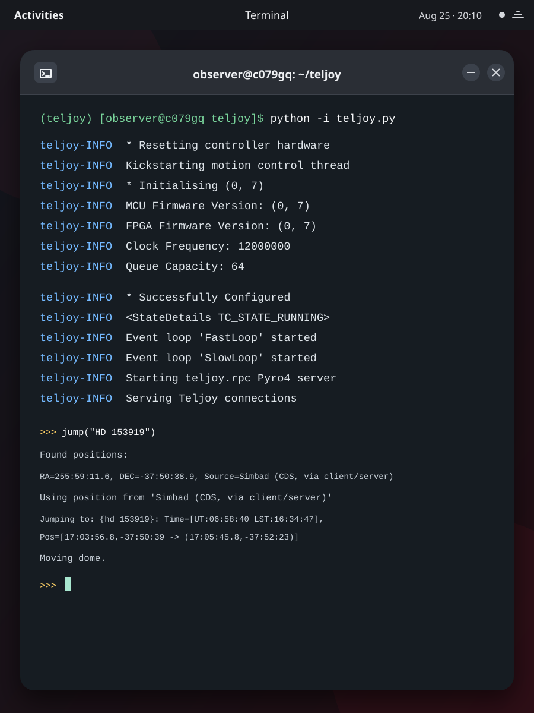
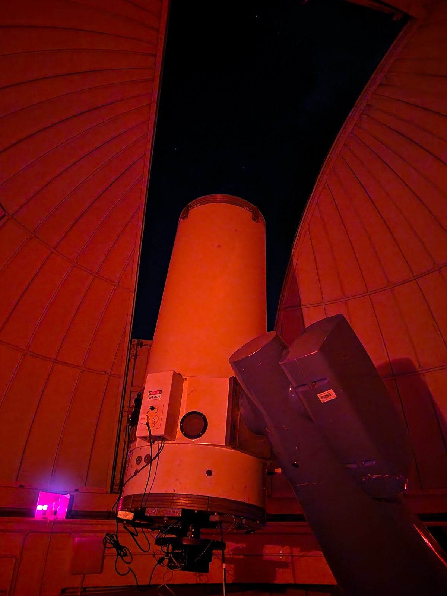
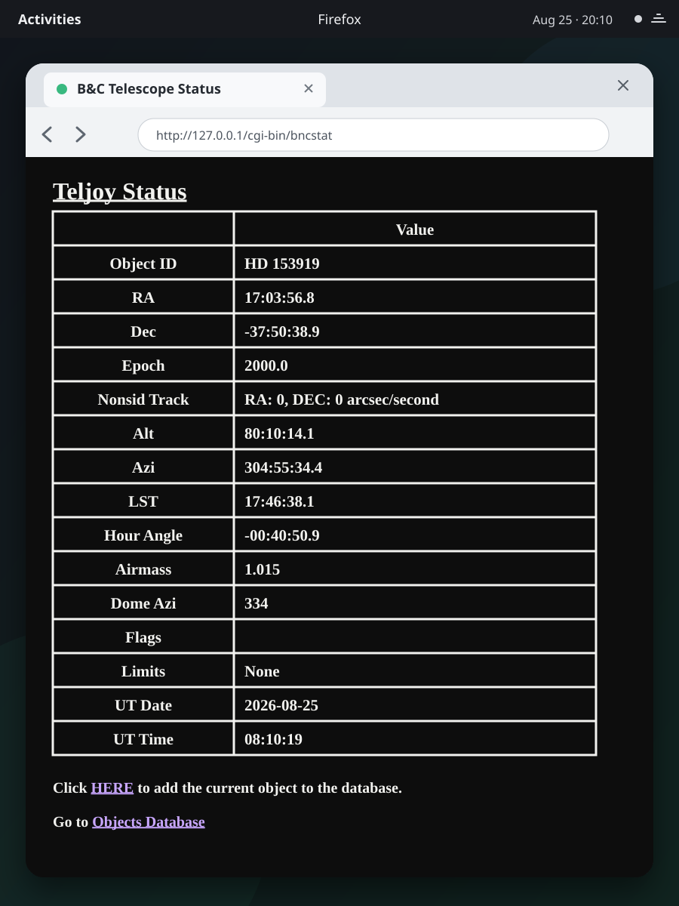

# Teljoy -- B&C 0.6m Telescope Control

<p align="center">
  
  
  
</p>

Teljoy is a telescope and dome control system used at both the University of Canterbury's Boller & Chivens 0.6m telescope and the Perth-Lowell Telescope at Perth Observatory. This fork contains the current Mt John configuration, including the Python 3 modernisation of the previous Python 2 system.

> [!CAUTION]
> Teljoy controls moving observatory hardware. Treat installation, configuration, database restoration, and first motion as safety-critical work. Keep a qualified operator at the telescope and always test limits/interlocks after making changes.

## Contents

- [Usage](#usage)
- [System overview](#system-overview)
- [Requirements](#requirements)
- [Fresh installation/migration instructions](#fresh-installationmigration-instructions)

## Usage

> **Double-click the Teljoy Telescope Control shortcut on the desktop of the control computer to run Teljoy.**

## System overview

| Component | Purpose                                                                                |
| --- |----------------------------------------------------------------------------------------|
| `teljoy.py` | Starts the controller, background loops, Pyro4 server, and interactive operator prompt |
| `controller.py`, `usbcon.py` | USB protocol and velocity-streaming motor control                                      |
| `motion.py`, `detevent.py`, `handpaddles.py` | Tracking, slews, guider corrections, limits, and operator input                        |
| `nzdome.py`, `digio.py` | Mt John dome encoder and motor I/O                                                     |
| `sqlint.py` | Telescope state and object database                                                    |
| `tjserver.py`, `extras/tjclient.py` | Pyro4 remote-control interface on TCP 9696                                             |
| `cgi/` | Apache CGI web pages for status, object list, and object editor                        |

## Requirements

### Hardware

The control computer has two telescope-control connections:

1. The velocity-streaming motion controller connected over USB, which has the ID `1bad:beef`.
2. The dome encoder connected through a USB-to-serial adapter at `/dev/ttyUSB0` and read at 9600 baud.

The telescope motors, hand paddles, safety limits, dome motor outputs, and ST-4/SBIG autoguider inputs connect to the motion controller hardware directly.

### Software

| Software             | Version |
|----------------------| --- |
| UC (SPCS) RHEL Image | RHEL 9.8 (`Plow`) |
| Python               | 3.12 in the `teljoy` Conda environment |
| MySQL Server         | 8.0.46 |
| Apache HTTP Server   | 2.4.62 |

The Python dependencies are in [`requirements.txt`](requirements.txt), however, some must be installed using Conda.

## Fresh installation/migration instructions

These instructions describe how to set up a new control computer. Ideally, this should be done by extracting the latest state of the current machine, however, you can also install things fresh if desired.

The current machine was migrated from the original Ubuntu 14.04/MySQL 5 installation to RHEL 9/MySQL 8 in August 2026.

### 1. Dump the previous system

1. Park the telescope and dome and confirm their physical positions.
2. Shut Teljoy down cleanly so no further state changes occur.
3. Take an application-only dump:

```bash
mysqldump -u root -p \
  --single-transaction --routines --events --triggers \
  teljoy \
  --result-file=/home/observer/teljoy_latest.sql
```

4. Copy the dump and the following two secret files to external media:

- `/home/observer/teljoy.dbpass`
- `/home/observer/teljoy.pyrokey`

### 2. Provision RHEL and create the operator account

1. Install the UC (SPCS) RHEL image and create `observer` as the telescope operator account during installation. The account needs a home directory at `/home/observer` and `sudo` permissions.

2. Configure the control computer with the IP address `132.181.49.156` on the Mt John observatory LAN.

3. Update the host and install the system services and administration tools:

```bash
sudo dnf update
sudo dnf install -y git mysql-server httpd acl usbutils policycoreutils-python-utils

sudo systemctl enable --now mysqld
sudo systemctl enable --now httpd
sudo mysql_secure_installation
```

### 3. Install Conda, clone Teljoy, and create the environment

1. Install Conda for `observer` so that the deployed environment lives below `/home/observer/.conda`.

2. Clone this repository:

```bash
cd /home/observer
git clone https://github.com/pattersonjack/teljoy.git
cd /home/observer/teljoy
```

3. Create the Conda environment and install dependencies:

```bash
conda create --name teljoy python=3.12
conda activate teljoy

conda install -c conda-forge mysqlclient=2.2.4 'mysql-libs<9' 'mysql-common<9' ephem=4.2
python -m pip install -r requirements.txt
```

`which python` must resolve to `/home/observer/.conda/envs/teljoy/bin/python`.

### 4. Install the copied secrets

1. Install the previous password and Pyro HMAC key from external media:

```bash
sudo install -o observer -g observer -m 600 /path/on/media/teljoy.dbpass /home/observer/teljoy.dbpass
sudo install -o observer -g observer -m 600 /path/on/media/teljoy.pyrokey /home/observer/teljoy.pyrokey
```

### 5. Configure the USB controller and dome serial port

1. Give `observer` access to the dome serial port:

```bash
sudo usermod -aG dialout observer
```

2. Log out and back in to apply the new group membership, then install the controller udev rule:

```bash
sudo tee /etc/udev/rules.d/teljoy.rules >/dev/null <<'EOF'
ATTRS{idVendor}=="1bad", MODE="0666"
EOF

sudo chmod 644 /etc/udev/rules.d/teljoy.rules
sudo udevadm control --reload-rules
sudo udevadm trigger --attr-match=idVendor=1bad
```

3. Verify both interfaces:

```bash
lsusb | grep -i '1bad:beef'
ls -l /dev/ttyUSB0
id observer
```

### 6. Restore the MySQL database

1. Copy the dump from external media to `/home/observer/teljoy_latest.sql`.

2. Create an empty database and restore the dump data:

```bash
mysql -u root -p <<'SQL'
SHOW DATABASES;
DROP DATABASE IF EXISTS teljoy;
CREATE DATABASE teljoy CHARACTER SET latin1 COLLATE latin1_swedish_ci;
SQL

mysql -u root -p teljoy < /home/observer/teljoy_latest.sql
```

This restores only the `teljoy` application dump as we don't want to migrate the source machine's system database. 

`latin1_swedish_ci` is MySQL's historical default `latin1` collation.

3. On a fresh MySQL installation, use the following script to create local application accounts using the password stored in `teljoy.dbpass`.

```bash
/home/observer/.conda/envs/teljoy/bin/python - <<'PY'
from getpass import getpass
from pathlib import Path

import MySQLdb

root_password = getpass('MySQL root password: ')
app_password = Path('/home/observer/teljoy.dbpass').read_text().strip()
if not app_password:
    raise SystemExit('teljoy.dbpass is empty')

db = MySQLdb.connect(user='root', passwd=root_password)
cursor = db.cursor()
for host in ('127.0.0.1', 'localhost'):
    account = "'honcho'@'%s'" % host
    cursor.execute(
        'CREATE USER IF NOT EXISTS %s IDENTIFIED BY %%s' % account,
        (app_password,),
    )
    cursor.execute(
        'ALTER USER %s IDENTIFIED BY %%s' % account,
        (app_password,),
    )
    cursor.execute(
        'GRANT SELECT, INSERT, UPDATE, DELETE ON teljoy.* TO %s' % account
    )
db.commit()
db.close()
print('Configured local honcho accounts and teljoy grants')
PY
```

4. Validate the restored schema and data before starting telescope control:

```bash
mysql -u root -p <<'SQL'
SELECT VERSION(), @@SESSION.sql_mode;
SELECT 'current' AS table_name, COUNT(*) AS rows_found FROM teljoy.current
UNION ALL SELECT 'objects', COUNT(*) FROM teljoy.objects
UNION ALL SELECT 'objtemp', COUNT(*) FROM teljoy.objtemp
UNION ALL SELECT 'tjbox', COUNT(*) FROM teljoy.tjbox;
SHOW CREATE TABLE teljoy.objects;
SHOW CREATE TABLE teljoy.objtemp;
SELECT name, LastMod FROM teljoy.current;
SQL
```

5. Finally, test access through the Teljoy Python environment:

```bash
conda activate teljoy
python - <<'PY'
from pathlib import Path
import MySQLdb

password = Path('/home/observer/teljoy.dbpass').read_text().strip()
db = MySQLdb.connect(host='127.0.0.1', user='honcho', passwd=password)
cursor = db.cursor()
cursor.execute('SELECT COUNT(*) FROM teljoy.objects')
print('teljoy.objects rows:', cursor.fetchone()[0])
db.close()
PY
```

### 7. Deploy Apache CGI, suEXEC, and SELinux settings

1. Run the CGI programs using a dedicated account rather than as `apache` or `observer`:

```bash
sudo useradd -M -s /sbin/nologin teljoyweb
```

2. Create `/etc/httpd/conf.d/teljoy.conf`:

```bash
sudo tee /etc/httpd/conf.d/teljoy.conf >/dev/null <<'APACHE'
<VirtualHost *:80>
    ServerName 132.181.49.156
    SuexecUserGroup teljoyweb teljoyweb

    ScriptAlias /cgi-bin/ "/var/www/cgi-bin/"
    <Directory "/var/www/cgi-bin">
        AllowOverride None
        Options +ExecCGI
        Require ip 127.0.0.1 ::1 132.181.49.0/24
    </Directory>
</VirtualHost>
APACHE
```

3. Make the CGI directories:

```bash
sudo tee /etc/tmpfiles.d/teljoy-cgi.conf >/dev/null <<'EOF'
d /var/www/cgi-bin        0755 teljoyweb teljoyweb -
d /var/www/cgi-bin/al     0755 teljoyweb teljoyweb -
d /var/www/cgi-bin/secure 0755 teljoyweb teljoyweb -
EOF

sudo systemd-tmpfiles --create /etc/tmpfiles.d/teljoy-cgi.conf
```

4. Install the three entry points and the object editor's support modules:

```bash
cd /home/observer/teljoy

sudo install -o teljoyweb -g teljoyweb -m 755 cgi/bncstat /var/www/cgi-bin/bncstat
sudo install -o teljoyweb -g teljoyweb -m 755 cgi/al/aobjlist /var/www/cgi-bin/al/aobjlist
sudo install -o teljoyweb -g teljoyweb -m 755 cgi/secure/nobjedit /var/www/cgi-bin/secure/nobjedit
sudo install -o teljoyweb -g teljoyweb -m 644 cgi/secure/nobjedit.py cgi/secure/nobjedithtml.py cgi/secure/htmlutil.py /var/www/cgi-bin/secure/
```

5. Grant the CGI account only the home-directory traversal and secret reads it needs:

```bash
sudo setfacl -m u:teljoyweb:--x /home/observer
sudo setfacl -m u:teljoyweb:r-- /home/observer/teljoy.pyrokey
sudo setfacl -m u:teljoyweb:r-- /home/observer/teljoy.dbpass
```

6. Label the Conda interpreter target for CGI execution and restore the standard labels below `/var/www/cgi-bin`:

```bash
readlink -f /home/observer/.conda/envs/teljoy/bin/python

sudo semanage fcontext -a -t httpd_sys_script_exec_t '/home/observer/.conda/envs/teljoy/bin/python3.12'
sudo restorecon -v /home/observer/.conda/envs/teljoy/bin/python3.12
sudo restorecon -RF /var/www/cgi-bin
```

7. Enable and persist the SELinux booleans required for CGI access to the `observer` home directory, MySQL, and Pyro:

```bash
sudo setsebool -P httpd_enable_homedirs on
sudo setsebool -P httpd_can_network_connect on
sudo setsebool -P httpd_can_network_connect_db on
```

8. Set SELinux flags:

```bash
sudo semanage permissive -a httpd_sys_script_t
sudo setenforce 1
getenforce
sudo semanage permissive -l | grep httpd_sys_script_t
```

The current deployment keeps SELinux globally enforcing and makes only the CGI script domain permissive.

9. When it is safe to initialise the telescope hardware, start Teljoy in a terminal and leave it running:

```bash
conda activate teljoy
cd /home/observer/teljoy
python -i teljoy.py
```

10. In a second terminal, restart and check Apache:

```bash
sudo apachectl configtest
sudo systemctl enable httpd
sudo systemctl restart httpd

stat -c '%U:%G %a %n' /var/www/cgi-bin /var/www/cgi-bin/al /var/www/cgi-bin/secure
curl -fsS -o /tmp/bncstat.html -w 'bncstat: HTTP %{http_code}\n' http://127.0.0.1/cgi-bin/bncstat
curl -fsS -o /tmp/aobjlist.html -w 'aobjlist: HTTP %{http_code}\n' http://127.0.0.1/cgi-bin/al/aobjlist
```

Both requests should return HTTP 200. Open `http://127.0.0.1/cgi-bin/bncstat` in a web browser and confirm that it shows live telescope data.

### 8. Restrict web access to the observatory LAN

```bash
sudo firewall-cmd --permanent --zone=public --add-rich-rule='rule family="ipv4" source address="132.181.49.0/24" port port="80" protocol="tcp" accept'
sudo firewall-cmd --reload
sudo firewall-cmd --zone=public --list-all
```

Test `http://132.181.49.156/cgi-bin/bncstat` from the camera control computer to confirm that MaxIm DL can retrieve pointing information for the FITS headers.

### 9. Create a desktop launcher

This shortcut starts the correct interpreter in interactive mode and leaves the shell open after Teljoy shuts down:

```ini
[Desktop Entry]
Type=Application
Name=Teljoy Telescope Control
Comment=Start Teljoy interactively
Path=/home/observer/teljoy
Exec=/usr/bin/bash -lc "/home/observer/.conda/envs/teljoy/bin/python -i /home/observer/teljoy/teljoy.py; exec /usr/bin/bash"
Icon=applications-engineering
Terminal=true
Categories=Science;
```

Save it as `/home/observer/Desktop/teljoy.desktop`, then:

```bash
chmod +x /home/observer/Desktop/teljoy.desktop
gio set /home/observer/Desktop/teljoy.desktop metadata::trusted true
```

Note: Modern GNOME requires the desktop icons extension to display files on the desktop.
